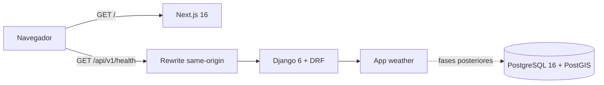
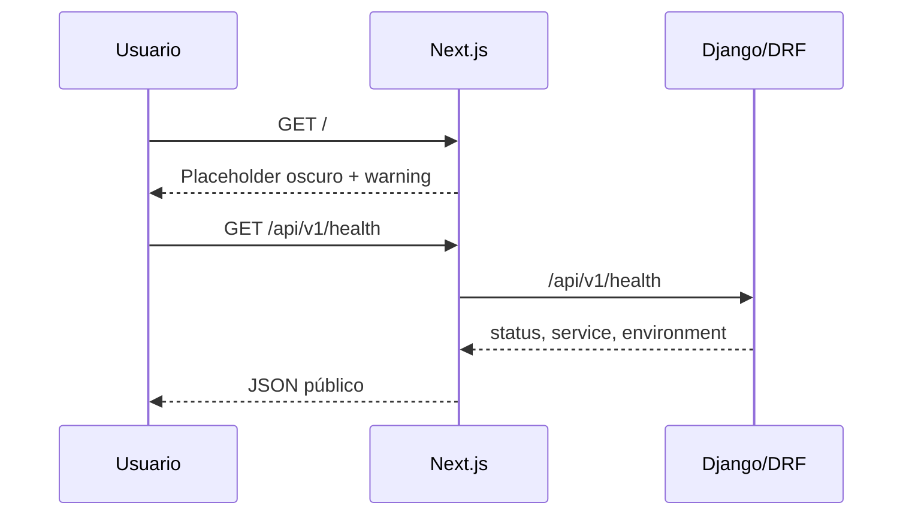

# Arquitectura — Aviation Weather Viewer

## Estado de Fase 00

El sistema es una base monorepo con dos procesos. Next.js entrega el placeholder
y usa rewrites same-origin para el backend. Django/DRF expone únicamente el
health. PostGIS es la única base soportada, aunque el health no depende de una
consulta para mantener una señal de liveness simple.

## Componentes

| Componente | Responsabilidad actual |
|---|---|
| `frontend/app/layout.tsx` | Metadata y documento raíz sin providers globales |
| `frontend/app/page.tsx` | Composición fullscreen estática de Fase 00 |
| `frontend/app/globals.css` | Único tema oscuro y tokens congelados |
| `frontend/next.config.ts` | Rewrites `/api/*` y `/media/*` al backend |
| `backend/aviation_weather_project/` | Settings, routing y entradas ASGI/WSGI |
| `backend/weather/` | Health público y futuro dominio meteorológico |

## Fronteras vigentes

- Una sola app Django de dominio: `weather`.
- API pública bajo `/api/v1/`, sin trailing slash y sin autenticación.
- No existen modelos de usuarios, catálogo o escenarios en Fase 00.
- No existe instancia MapLibre, store funcional ni carga de assets.
- La media queda ignorada salvo el futuro subárbol versionado
  `backend/media/demo-weather/demo-colombia-001/`.

## Flujo actual

## Evolución prevista

Las fases posteriores incorporarán mapa, catálogo de assets, viento,
temperatura, aeropuertos y controles. Cada fase debe extender esta base sin
reintroducir capacidades del starter ni crear una segunda dirección visual.
