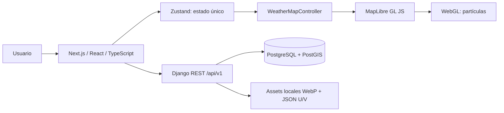
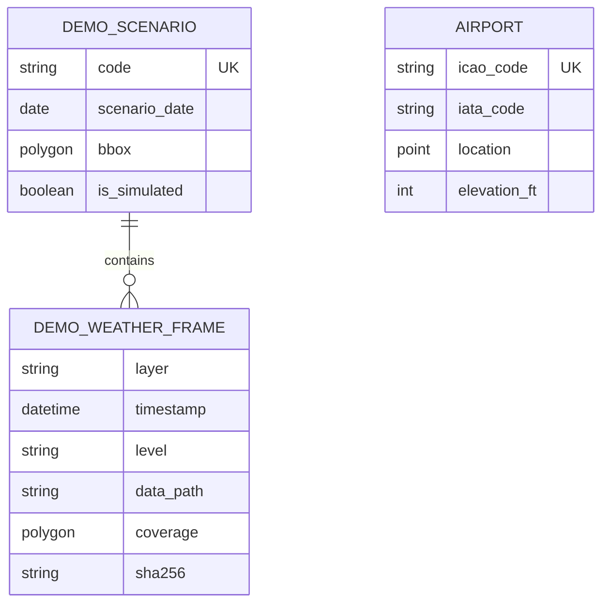
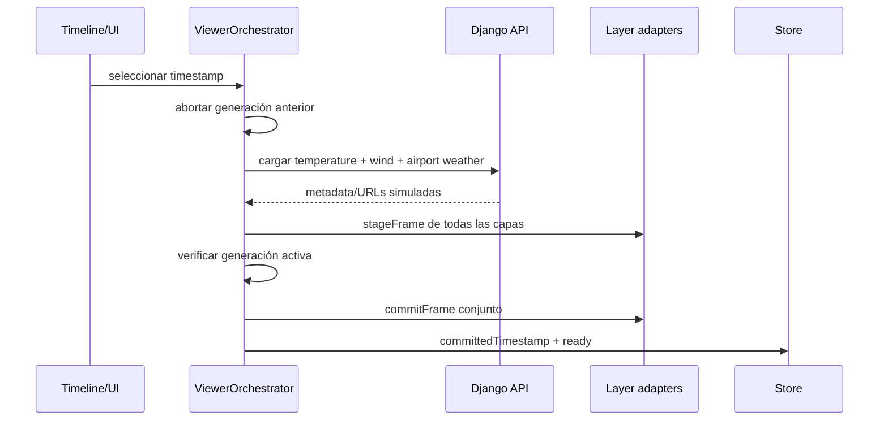
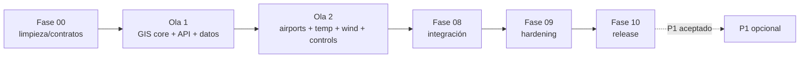

# Architecture — Aviation Weather Viewer MVP

> Memory Bank · actualizado 2026-08-19. Arquitectura objetivo aprobada; el
> código actual sigue siendo el scaffold hasta ejecutar la fase 00.

## Vista de sistema objetivo



- React controla paneles, timeline, leyenda y estados.
- El store expresa intención/estado committed; no almacena MapLibre.
- `WeatherMapController` conserva una instancia estable y recibe adapters.
- MapLibre controla cámara, sources, layers e interacción geográfica.
- WebGL mueve partículas en cliente; fallback usa flechas estáticas.
- Django publica catálogo, frames, aeropuertos y metadata simulada.
- PostGIS almacena puntos/coberturas; assets pesados viven en filesystem.

## Modelo de datos objetivo



No existe relación de partículas/celdas con la base de datos.

## Flujo temporal atómico



Ante cualquier fallo se conserva completo el timestamp anterior.

## Basemap y assets

- Style/GeoJSON Natural Earth bajo `frontend/public/map/`.
- Meteorología bajo `backend/media/demo-weather/demo-colombia-001/`.
- Ningún tile, glyph, sprite o API remoto durante la demostración.
- Django/nginx expone assets same-origin y DB conserva rutas relativas.

## Separación frontend prevista

```text
frontend/
├── app/page.tsx
├── components/weather/
├── features/{airports,timeline,viewer,weather}/
├── lib/{services,stores,weather}/
└── map/
    ├── WeatherMapController.ts
    ├── adapters/
    ├── layers/{airport,temperature,wind}/
    └── renderers/wind/
```

## Estrategia de entrega



El índice/ownership exactos están en `docs/MVP_roadmap/phase_scopes/README.md`.

## Estado actual

- `master` contiene el scaffold de comercio sin lógica meteorológica.
- Fase 00 será la única limpieza transversal.
- No existen todavía dominio, PostGIS operativo ni servicios demo.
- Este paquete documental es el contrato para iniciar implementación.
