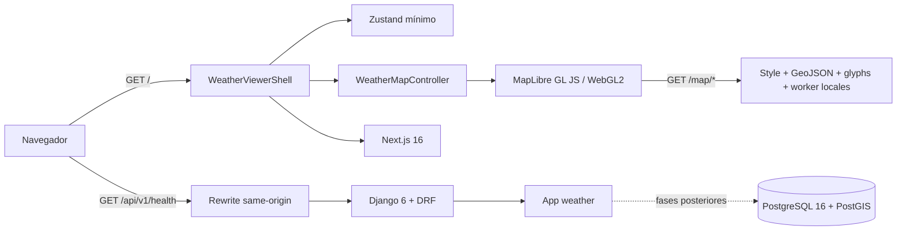
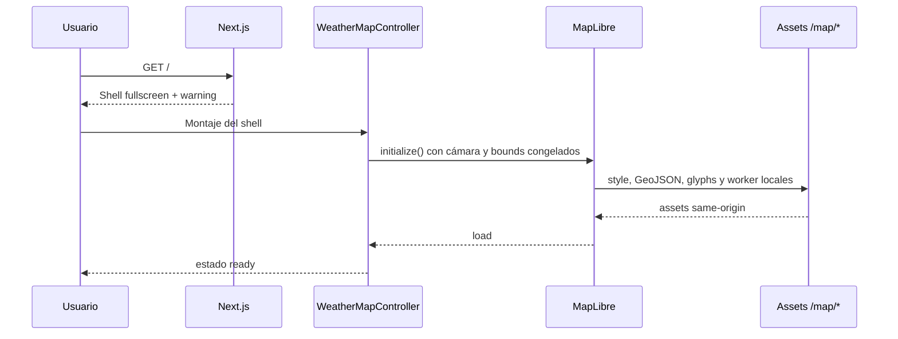
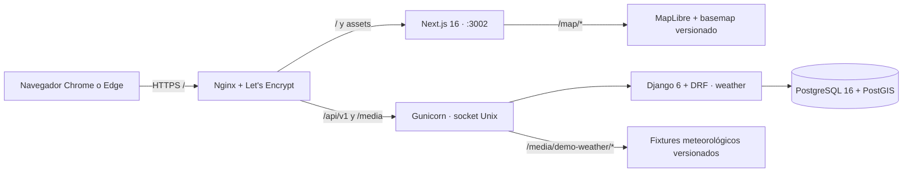
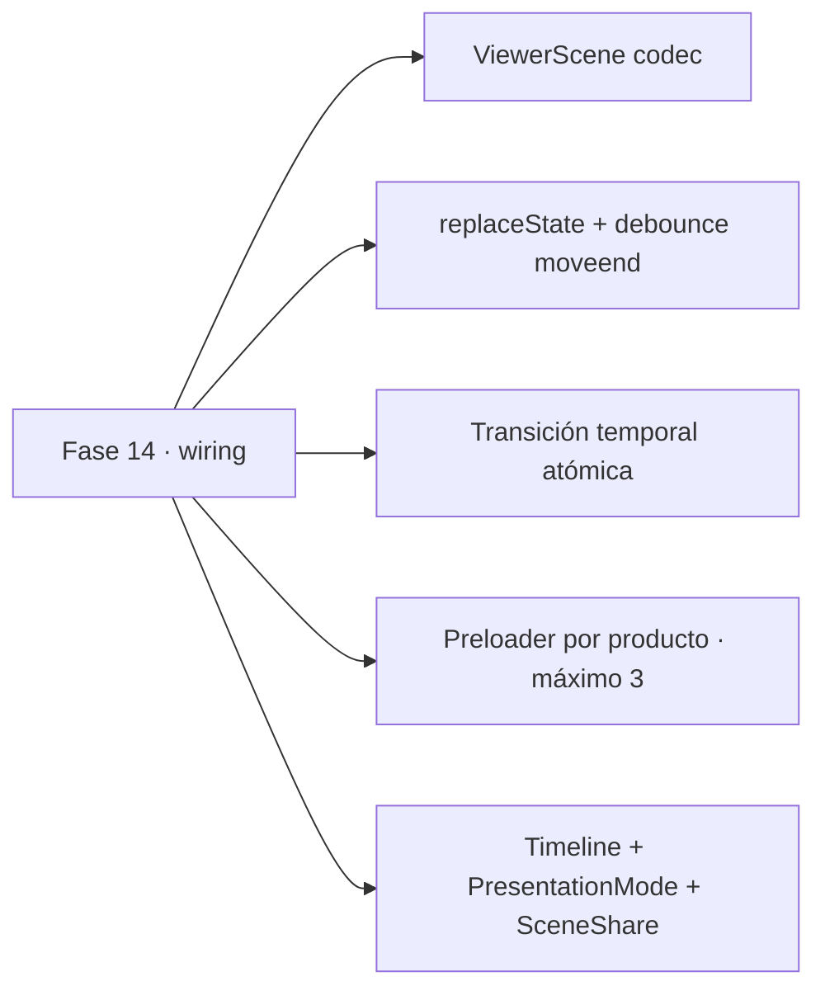
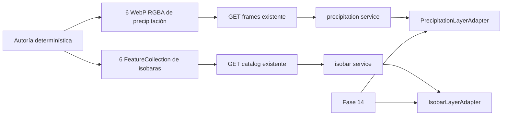
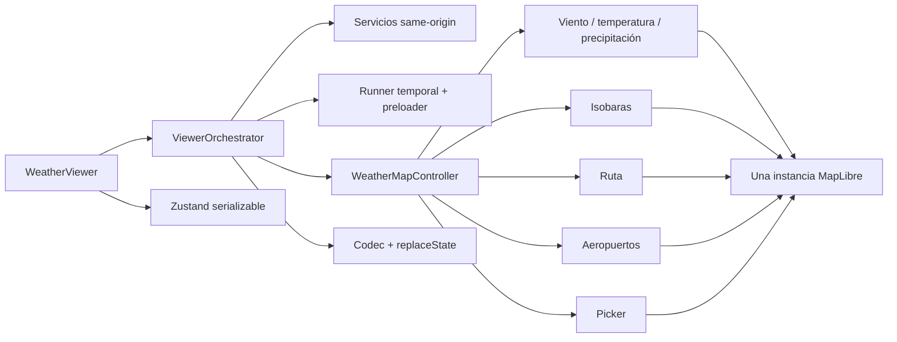
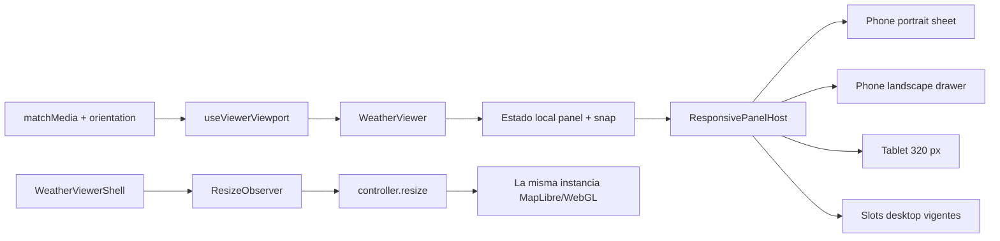
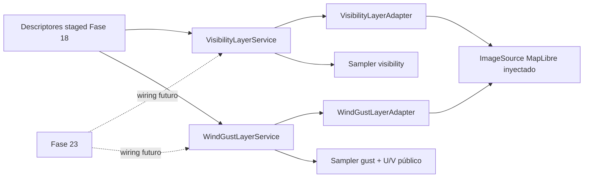
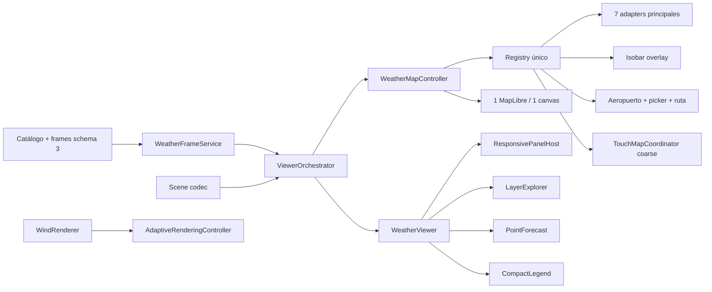

# Arquitectura — Aviation Weather Viewer

## Estado histórico de Fase 01

El sistema conserva los dos procesos de Fase 00. Next.js entrega ahora el shell
GIS y una única instancia MapLibre; Django/DRF continúa exponiendo únicamente
el health. El mapa base no consulta al backend: style, geometrías, glyphs y Web
Worker se sirven como assets same-origin versionados.



## Componentes

| Componente | Responsabilidad actual |
|---|---|
| `frontend/app/layout.tsx` | Metadata y documento raíz sin providers globales |
| `frontend/app/page.tsx` | Entrada fullscreen que monta el shell GIS y CSS MapLibre |
| `frontend/components/weather/WeatherViewerShell/` | Composición, slots y estados loading/ready/error |
| `frontend/map/WeatherMapController.ts` | Dueño de la instancia MapLibre, cámara, lifecycle y adapters |
| `frontend/lib/stores/weatherViewerStore.ts` | Estado mínimo del visor, sin mapa ni viewport |
| `frontend/public/map/` | Basemap, labels, glyphs, worker y avisos locales |
| `frontend/app/globals.css` | Único tema oscuro y tokens congelados |
| `frontend/next.config.ts` | Rewrites `/api/*` y `/media/*` al backend |
| `backend/aviation_weather_project/` | Settings, routing y entradas ASGI/WSGI |
| `backend/weather/` | Health público y futuro dominio meteorológico |

## Fronteras vigentes

- Una sola app Django de dominio: `weather`.
- API pública bajo `/api/v1/`, sin trailing slash y sin autenticación.
- No existen modelos de usuarios, catálogo o escenarios en Fase 00.
- Existe una sola instancia MapLibre y React no la almacena en el store.
- El registry admite adapters `temperature`, `wind` y `airports`, pero queda
  vacío en esta fase.
- La cámara pertenece exclusivamente al controller.
- No existen capas meteorológicas, aeropuertos ni llamadas de datos en Fase 01.
- La media queda ignorada salvo el futuro subárbol versionado
  `backend/media/demo-weather/demo-colombia-001/`.

## Flujo actual



## Evolución prevista

Las fases posteriores conectarán adapters de viento, temperatura y aeropuertos,
y luego controles/orquestación. Ninguna debe crear una segunda instancia
MapLibre ni importar internals del controller fuera de su interfaz pública.

## Arquitectura desplegada — Fase 08



- El browser sólo solicita el dominio de la demo; no existen requests
  meteorológicos ni cartográficos externos.
- Next y Django se ejecutan como servicios systemd separados con límites de
  memoria/CPU y Nginx conserva el contrato same-origin.
- El renderer de partículas mantiene densidad fija de 2500. Ante fallo runtime,
  el mismo adapter publica fallback de flechas estáticas sin recrear MapLibre ni
  inutilizar controles/timeline.
- La copia local usa la misma composición y fixtures. Django debe arrancarse en
  `development` para que `runserver` sirva `/media/*`; staging usa Nginx.
- La topología quedó congelada con la integración del PR QA #13. El SHA
  `054ebdd27b459ba24cff3d65f580ea7bbae95f0d` fue desplegado y recorrió health +
  E2E live sin cambios de arquitectura ni dependencias externas.
- La coordenada operativa quedó publicada en `vps-ops-toolkit` mediante
  `b0f2a244f99f2477bd828b69a45c8296e38a4d35`. Conserva `status: scaffold`
  hasta que el resolver canónico pueda asignar `server:`; esto no altera la
  topología ya desplegada en staging.

## Módulos aislados de Fase 09

```text
AirportFeatureCollection → searchAirports → AirportSearch → onSelectAirport
DemoAirportIcao → useAirportWeatherSeries/cache → 6 GET existentes
                → AirportTrend → onSelectTimestamp
```

La cache `Map` y los `AbortController` viven dentro del hook, nunca en Zustand.
`AirportSearch` y `AirportTrend` no conocen MapLibre, controller u orquestador;
Fase 14 será dueña del wiring y Fase 12 consumirá el ranking público.

## Arquitectura aislada — Fase 10

El endpoint de frames valida y publica `value_data_url` únicamente para
temperatura. En el navegador, `WeatherPickerDataService` carga el grid térmico y
el campo U/V del mismo timestamp, acepta un U/V ya disponible y conserva como
máximo el activo y sus adyacentes. El sampler puro verifica cobertura antes de
reutilizar la interpolación de viento que clampa bordes, por lo que un punto
externo nunca se convierte en un valor válido.

`CoordinatePickerAdapter` es dueño sólo de su source, layer y listener; el panel
React es controlado. Ambos quedan sin registrar en el controller, store u
orquestador hasta la Fase 14. No se añadió endpoint de muestreo, generación en
runtime ni dependencia externa.

## Módulos aislados de Fase 11



- `features/timeline` posee plan adyacente, cache abortable y runner de fases;
  no publica timestamps ni errores globales.
- `features/presentation` posee tipos de escena, codec puro y sincronizador
  browser inyectable; no importa store, controller ni orquestador.
- Los componentes nuevos reciben estado/callbacks. Fase 14 decide composición,
  restauración y qué chrome secundario ocultar.

## Integración auditada — Gate de la ola E1

Los tres heads funcionales partieron de `d1b5767`. Cuando esta sesión recibió
el gate, GitHub ya los había integrado por squash en el orden real Fase 11
(`#17`, `5f6f624`) → Fase 10 (`#18`, `e6d2f28`) → Fase 09 (`#16`, `6795540`).
El censo retrospectivo de `merge-queue` encontró la cola vacía y no reescribió
historia ni repitió merges.

Los diffs funcionales son disjuntos y ninguno toca `page.tsx`, store,
`WeatherMapController`, `viewerTypes`, `ViewerOrchestrator` ni flows E2E. Fase
14 conserva en exclusiva el wiring de búsqueda, picker, timeline, URL y modo
presentación. La precondición explícita de esta sesión declara el Gate E1 en GO;
Fase 12 no reabre ni modifica el refinamiento de
`AirportFeatureCollection` registrado durante ese gate.

## Arquitectura aislada — Fase 12

```text
AirportFeatureCollection + DemoRoute + DemoTimestamp + WindField
  -> analyzeRoute (puro, 24 muestras)
  -> RouteAnalysis
  -> routeAnalysisToGeoJson -> RouteLayerAdapter
  -> RouteProfile
```

`RoutePlanner` reutiliza `searchAirports` y sólo emite callbacks controlados.
`analyzeRoute` valida cobertura antes del sampler público U/V y no redondea los
cálculos internos. `RouteLayerAdapter` posee un source y dos layers, sin
listeners ni registro central; Fase 14 recibe los módulos públicos y decide su
lifecycle real junto con timestamp, loading, error y retry.

## Arquitectura objetivo posterior a Fase 14

Las Fases 15–23 están planificadas, no implementadas. Mantienen una instancia
MapLibre y añaden fronteras aisladas antes de un wiring final:

~~~mermaid
flowchart LR
    Shell[Responsive shell] --> Host[Panel host efímero]
    Host --> Explorer[Layer explorer]
    Host --> Point[Point forecast]
    Touch[Touch coordinator] --> Controller[WeatherMapController]
    Controller --> MapLibre[Una instancia MapLibre]
    Controller --> NewAdapters[Cloud/visibility/gust adapters]
    Quality[Adaptive renderer] --> Wind[Wind WebGL]
    API[Django catálogo schema 3] --> Assets[42 frames + isobaras]
    Assets --> NewAdapters
    Assets --> Point
~~~

- Panel, orientación y perfil gráfico permanecen fuera de Zustand y URL.
- Cuatro capas nuevas se generan staged; manifest/API solo pasan a schema 3 en
  Fase 23 junto con el parser frontend.
- Las Olas M1 y M2 entregan módulos aislados. Fase 23 conserva ownership
  exclusivo de API, store, controller, orquestador, scene codec y E2E.
- Una capa principal está visible; pressure-isobars continúa como overlay.

## Capas atmosféricas aisladas — Fase 13



Los contornos se calculan únicamente en `generation.py` y se versionan como
GeoJSON; ni los requests ni el navegador ejecutan marching squares. El catálogo
valida cada overlay antes de publicar su URL same-origin, mientras el endpoint
de frames reutiliza el contrato vigente para precipitación.

Los adapters poseen sus propios requests, sources y layers. Precipitación
mantiene el último frame confirmado si falla un reemplazo; isobaras empiezan
ocultas, abortan al ocultarse y degradan a overlay ausente sin propagar el fallo
a la capa principal. Ambos invalidan respuestas tardías por versión y eliminan
todos sus recursos en `destroy()`.

La única compatibilidad central autorizada en esta fase está en
`weatherService.ts`: valida que el catálogo enriquecido tenga las tres capas,
pero conserva el DTO visible de temperatura/viento hasta que Fase 14 amplíe
`viewerTypes`, store, selector y controller.

## Arquitectura integrada — Fase 14



- El controller registra adapters en orden meteorología → isobaras → ruta →
  aeropuertos → picker. Sus callbacks arbitran aeropuerto antes de picker y
  publican viewport únicamente en `moveend`.
- El store conserva sólo escena serializable: coordinate, route, overlay,
  presentation y viewport. Grids, U/V, mapa, caches, timers y abort controllers
  permanecen en servicios, adapters u orquestador.
- El orquestador es dueño de bootstrap URL previo a datos, carreras de frame,
  carga derivada del mismo timestamp, commit atómico, precarga adyacente,
  playback, reset y teardown.
- Los errores de isobaras quedan separados del frame principal. Los errores de
  producto mantienen la escena confirmada anterior y nunca crossfadean dos
  timestamps.
- Presentación contrae chrome secundario pero conserva warning, UTC, selector,
  leyenda, timeline, resumen de escena y salida.

## Arquitectura responsive integrada — Fase 15



- `useViewerViewport` posee las suscripciones `MediaQueryList`, `resize` y
  `orientationchange`, junto con su cleanup. Su fallback SSR/JSDOM es desktop.
- `WeatherViewer` conserva panel activo y snap exclusivamente en estado React;
  una selección de aeropuerto, coordenada o ruta abre el panel pertinente sin
  serializar presentación en store o URL.
- `ResponsivePanelHost` recibe contenido por slots controlados. Gestiona
  apertura, snap, cierre, Escape, foco inicial y restauración al disparador; no
  conoce MapLibre ni el orquestador.
- `WeatherViewerShell` monta una sola superficie cartográfica. El host cambia
  composición alrededor de ella y `ResizeObserver` llama `resize()` sin
  reconstruir controller, adapters, canvas o contexto WebGL.
- El viewport usa `viewport-fit=cover`, `100vh` como fallback, `100dvh` y
  variables CSS basadas en `env(safe-area-inset-*)`.

## Arquitectura aislada — Fase 20



- Cada service posee fetch, abort, versión de request, cache LRU de `1–3`
  frames y object URLs; cada adapter posee exclusivamente su source/layer.
- Raster y grid tienen fronteras de error separadas: un grid fallido conserva
  el raster, mientras un raster fallido nunca reemplaza el frame confirmado.
- `setFrame()` usa `ImageSource.updateImage()` y no recrea resources. Visibility,
  opacidad, reset y destroy son idempotentes y toleran lifecycle parcial.
- Los samplers reciben grids ya cargados y no conocen marcador, store,
  controller ni fetch. Ráfagas reutilizan el sampler U/V público sin importar o
  modificar `WindRenderer` o partículas.
- Registro central, composición, catálogo vivo y schema 3 permanecen reservados
  a Fase 23.

## Arquitectura integrada — Fase 23



- `WeatherFrameService` valida schema 3 y coordina raster/grid por descriptor.
  Services específicos conservan cache, request-version, abort y object URLs.
- `ViewerOrchestrator` posee la barrera temporal. El frame principal y todos los
  consumidores visibles se preparan para el mismo timestamp antes del commit.
- El controller registra los siete adapters una sola vez, mantiene exclusividad
  de capa principal y conserva isobaras fuera de esa exclusión.
- `AdaptiveRenderingController` sólo está activo cuando `wind` es visible. Sus
  eventos de perfil/visibility suben al snapshot del orquestador, no a Zustand
  ni a la URL.
- `TouchMapCoordinator` se crea una vez sólo con pointer coarse. Una excepción
  de setup deja disponibles paneles y arbitraje click de desktop.
- Responsive cambia host/layout alrededor del mapa. Resize y orientation sólo
  llaman `resize()`; teardown destruye en orden inverso e idempotente.
- `ViewerProductBoundary` mantiene loading/error local por producto; una falla
  de explorer vuelve a quick row y una falla de grid no oculta el raster.
- El warning y reset viven fuera de los paneles. Presentation mode conserva
  warning y salida visible.

El backend mantiene generación offline y validación runtime por hash/semántica;
no existe endpoint point-sample ni generación por request. API/media permanecen
same-origin y nunca exponen paths internos.
