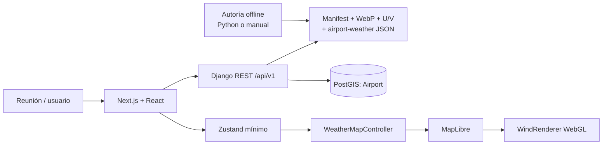
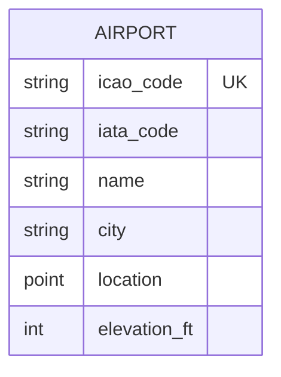
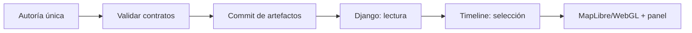
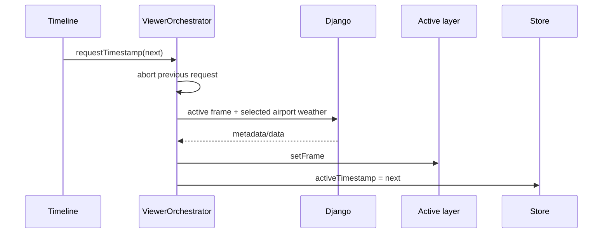
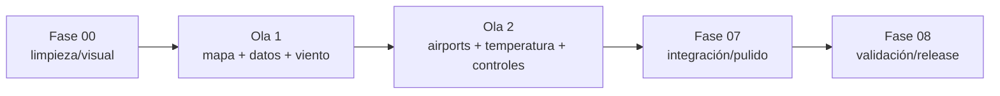

# Architecture — Demo visual meteorológica de Colombia

> Memory Bank · actualizado 2026-08-19. Arquitectura objetivo; la fase 00 aún
> debe retirar el scaffold actual.

## Vista del sistema



- React compone controles/paneles; no controla internals cartográficos.
- Zustand conserva solo intención visible y estados de carga/error.
- Controller mantiene una instancia MapLibre y registra adapters.
- MapLibre gestiona cámara, basemap, layers y eventos geográficos.
- WebGL mueve partículas; flechas GeoJSON son fallback.
- Django lee y publica manifiesto, frames, aeropuertos y clima simulado; no los
  genera durante startup o requests.
- PostGIS almacena únicamente puntos de aeropuerto.
- La autoría offline produce artefactos versionados; puede usar un generador
  determinístico o la contingencia manual bajo el mismo validador.

## Persistencia mínima



Escenario, layers y doce frames viven en `manifest.json`; treinta y seis
condiciones viven en `airport-weather.json`. No hay modelos de frame, cobertura,
partículas o celdas.

## Ciclo de datos



El dataset no muta en runtime. La dinámica surge de seleccionar uno de los seis
frames y animar el U/V activo; una recarga reconstruye la misma secuencia.

## Flujo de timestamp



El frame anterior continúa visible durante loading. Si algo falla, no cambia el
timestamp visible y se ofrece retry/reset. Como una sola capa meteorológica está
activa, no existe doble buffer global ni cache LRU.

## Basemap y composición

- Style/GeoJSON local bajo `frontend/public/map/`.
- Cobertura y navegación limitadas a Colombia/contexto inmediato.
- Meteorología versionada bajo `backend/media/demo-weather/demo-colombia-001/`.
- Tema único oscuro; chrome translúcido y layout objetivo `1920×1080`.
- Ningún tile, glyph, sprite, font o API remoto durante la reunión.

## Separación frontend

```text
frontend/
├── app/page.tsx
├── components/weather/
├── features/{airports,timeline,viewer,weather}/
├── lib/{services,stores,weather}/
└── map/
    ├── WeatherMapController.ts
    ├── layers/{airport,temperature,wind}/
    └── renderers/wind/
```

## Estrategia de entrega



## Estado actual

- `master` conserva el scaffold de comercio.
- El paquete documental recortado vive en el PR de scopes.
- No existen todavía dominio weather, PostGIS operativo ni visor.
- La próxima ejecución autorizada es fase 00.
