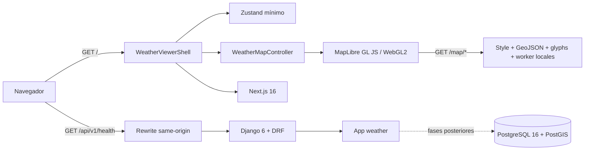
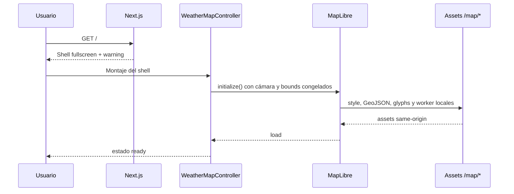

# Arquitectura — Aviation Weather Viewer

## Estado de Fase 01

El sistema conserva los dos procesos de Fase 00. Next.js entrega ahora el shell
GIS y una única instancia MapLibre; Django/DRF continúa exponiendo únicamente
el health. El mapa base no consulta al backend: style, geometrías, glyphs y Web
Worker se sirven como assets same-origin versionados.

## Componentes

| Componente | Responsabilidad actual |
|---|---|
| `frontend/app/layout.tsx` | Metadata y documento raíz sin providers globales |
| `frontend/app/page.tsx` | Entrada fullscreen que monta el shell GIS y CSS MapLibre |
| `frontend/components/weather/WeatherViewerShell/` | Composición, slots y estados loading/ready/error |
| `frontend/map/WeatherMapController.ts` | Dueño de la instancia MapLibre, cámara, lifecycle y adapters |
| `frontend/lib/stores/weatherViewerStore.ts` | Estado mínimo del visor, sin mapa ni viewport |
| `frontend/public/map/` | Basemap, labels, glyphs, worker y avisos locales |
| `frontend/app/globals.css` | Único tema oscuro y tokens congelados |
| `frontend/next.config.ts` | Rewrites `/api/*` y `/media/*` al backend |
| `backend/aviation_weather_project/` | Settings, routing y entradas ASGI/WSGI |
| `backend/weather/` | Health público y futuro dominio meteorológico |

## Fronteras vigentes

- Una sola app Django de dominio: `weather`.
- API pública bajo `/api/v1/`, sin trailing slash y sin autenticación.
- No existen modelos de usuarios, catálogo o escenarios en Fase 00.
- Existe una sola instancia MapLibre y React no la almacena en el store.
- El registry admite adapters `temperature`, `wind` y `airports`, pero queda
  vacío en esta fase.
- La cámara pertenece exclusivamente al controller.
- No existen capas meteorológicas, aeropuertos ni llamadas de datos en Fase 01.
- La media queda ignorada salvo el futuro subárbol versionado
  `backend/media/demo-weather/demo-colombia-001/`.

## Flujo actual

## Evolución prevista

Las fases posteriores conectarán adapters de viento, temperatura y aeropuertos,
y luego controles/orquestación. Ninguna debe crear una segunda instancia
MapLibre ni importar internals del controller fuera de su interfaz pública.
